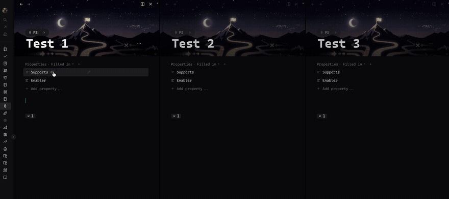
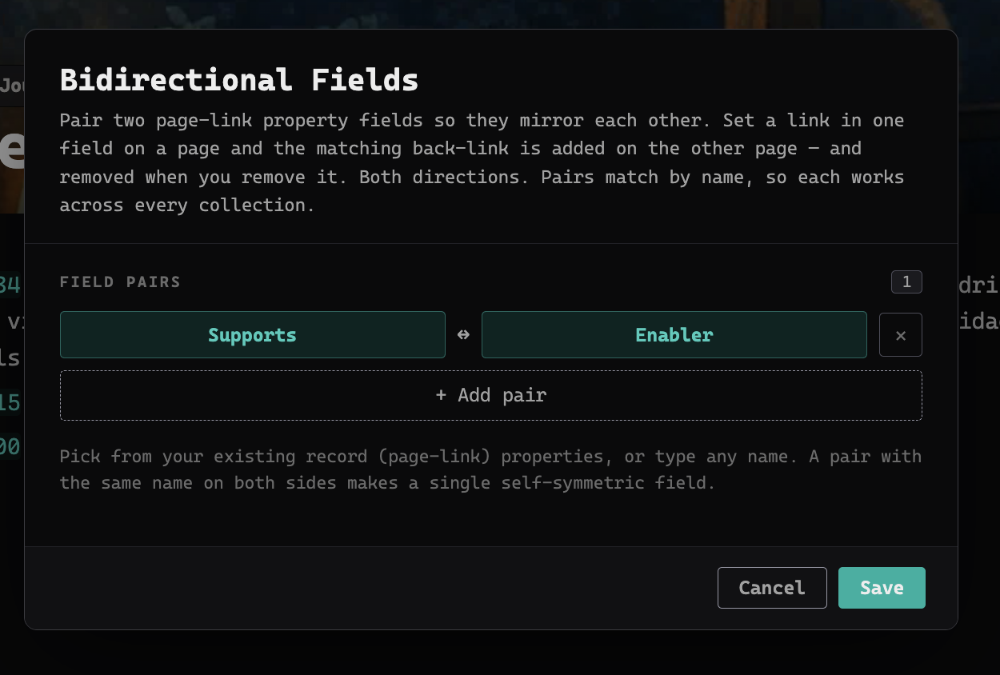

# Bidirectional Fields

A workspace-wide Thymer plugin that keeps two **page-link** property fields in
sync as inverses of each other.



**Nothing is mirrored out of the box.** You choose which two of *your* page-link
fields to pair, in the settings — matched by name, so it works with whatever your
collections call them.

For example, pairing **Supports ↔ Enabler**:

- Set page **A**'s *Supports* to link page **B** → **B**'s *Enabler* gains **A**.
- Set page **A**'s *Enabler* to link page **B** → **B**'s *Supports* gains **A**.

Both directions, and **fully mirrored**:

- **Adding** a link *appends* the reciprocal on the other page — existing values
  are preserved, never overwritten.
- **Removing** a link removes the reciprocal on the other page too. Clear a value
  (or empty the whole field) on one page and the matching back-link disappears
  from the other. You only ever edit one side.

## Requirements

Both paired fields must be **Page link (record) type** with **"Allow multiple
values"** enabled, so links can accumulate.

## How it works

A `MutationObserver` watches the open property panels. The first time a page is
seen (panel render, or plugin load) the plugin captures a baseline of its paired
fields — no writes. On a later edit it diffs new vs baseline and mirrors only what
**changed**: values added → add the reciprocal, values removed → remove the
reciprocal. Then it updates the baseline.

This delta approach is what makes deletion safe. A naive "make both sides agree"
rule oscillates: one half re-creates a forward link from a surviving back-link
while the other half deletes that back-link, and they fight. Mirroring only the
actual change side-steps that entirely — nothing is ever re-derived from a
back-link, so nothing resurrects and the sync always converges.

Matching is by property **name**, so the same pair works in every collection and
across "trees". If a target page's collection doesn't have the partner field,
that side is silently skipped.

## Configuration

Run the **Bidirectional Fields: Settings** command to open a visual editor. Add
pairs, and for each side pick a property from the list of your existing page-link
fields (gathered across all collections) or type any name. Click **Save** — the
change applies immediately.



A pair with the same name on both sides (e.g. `Related ↔ Related`) makes a single
self-symmetric field. With no pairs configured, nothing is mirrored — add at least
one pair for the plugin to do anything.

Settings are stored in the plugin config under `custom.pairs`, which you can also
edit by hand:

```json
{
  "custom": {
    "pairs": [
      ["Supports", "Enabler"],
      ["Blocks", "Blocked by"]
    ]
  }
}
```

## Commands

- **Bidirectional Fields: Settings** — open the visual pair editor.
