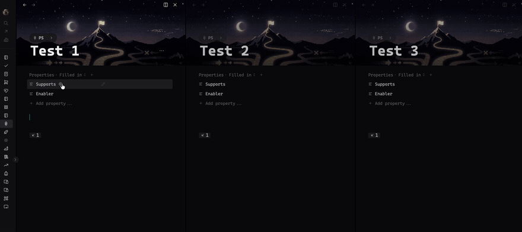
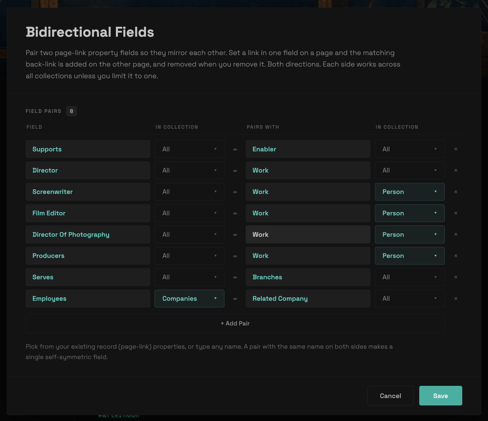

# Bidirectional Fields

A workspace-wide Thymer plugin that keeps two **page-link** property fields in
sync as inverses of each other.



**Nothing is mirrored out of the box.** You choose which two of *your* page-link
fields to pair, in the settings — matched by name, so it works with whatever your
collections call them.

For example, pairing **Supports ↔ Enabler**:

- Set page **A**'s *Supports* to link page **B** → **B**'s *Enabler* gains **A**.
- Set page **A**'s *Enabler* to link page **B** → **B**'s *Supports* gains **A**.

Both directions, and **fully mirrored**:

- **Adding** a link *appends* the reciprocal on the other page — existing values
  are preserved, never overwritten.
- **Removing** a link removes the reciprocal on the other page too. Clear a value
  (or empty the whole field) on one page and the matching back-link disappears
  from the other. You only ever edit one side.

## Requirements

Both paired fields must be **Page link (record) type**. **"Allow multiple values"**
is recommended so reciprocals can accumulate. A single-value field also works, but
it can only hold one reciprocal: if it is already set to a different page, the
plugin leaves that value alone and shows a toast naming the conflict, rather than
overwriting it or silently failing.

## How it works

A `MutationObserver` watches the open property panels. The first time a page is
seen (panel render, or plugin load) the plugin captures a baseline of its paired
fields — no writes. On a later edit it diffs new vs baseline and mirrors only what
**changed**: values added → add the reciprocal, values removed → remove the
reciprocal. Then it updates the baseline.

This delta approach is what makes deletion safe. A naive "make both sides agree"
rule oscillates: one half re-creates a forward link from a surviving back-link
while the other half deletes that back-link, and they fight. Mirroring only the
actual change side-steps that entirely — nothing is ever re-derived from a
back-link, so nothing resurrects and the sync always converges.

Matching is by property **name**, so the same pair works in every collection and
across "trees". If a target page's collection doesn't have the partner field,
that side is silently skipped.

## Configuration

Run the **Bidirectional Fields: Settings** command to open a visual editor. Add
pairs, and for each side pick a property from the list of your existing page-link
fields (gathered across all collections) or type any name, then optionally limit
that side to one collection. Click **Save** and the change applies immediately.
The dialog follows your Thymer theme.



A pair with the same name on both sides (e.g. `Related ↔ Related`) makes a single
self-symmetric field. With no pairs configured, nothing is mirrored — add at least
one pair for the plugin to do anything.

### Limiting a pair to certain collections

By default a pair applies wherever the two field names exist. Each side has an
**In collection** dropdown, reading *All* until you limit it; open it and switch
from **All collections** to **One collection** to pick one. This matters when a
field name is reused across collections but the pairing only makes sense from one
of them.

Example: `Related Company` exists on People, Actions, Invoices and more, while
`Employees` exists only on Companies. Unscoped, adding a Related Company to an
*Action* would put the Action into the company's Employees. Scoped as
`Related Company in Person ↔ Employees in Companies`, only People are mirrored
into Employees, and adding a non-Person to Employees writes nothing back.

Settings are stored in the plugin config under `custom.pairs`, which you can also
edit by hand. Unscoped pairs are two-name arrays; scoped ones are objects with a
collection id per side (`null` = any):

```json
{
  "custom": {
    "pairs": [
      ["Supports", "Enabler"],
      { "a": "Related Company", "aCol": "<Person collection id>",
        "b": "Employees",       "bCol": "<Companies collection id>" }
    ]
  }
}
```

## Commands

- **Bidirectional Fields: Settings** — open the visual pair editor.
